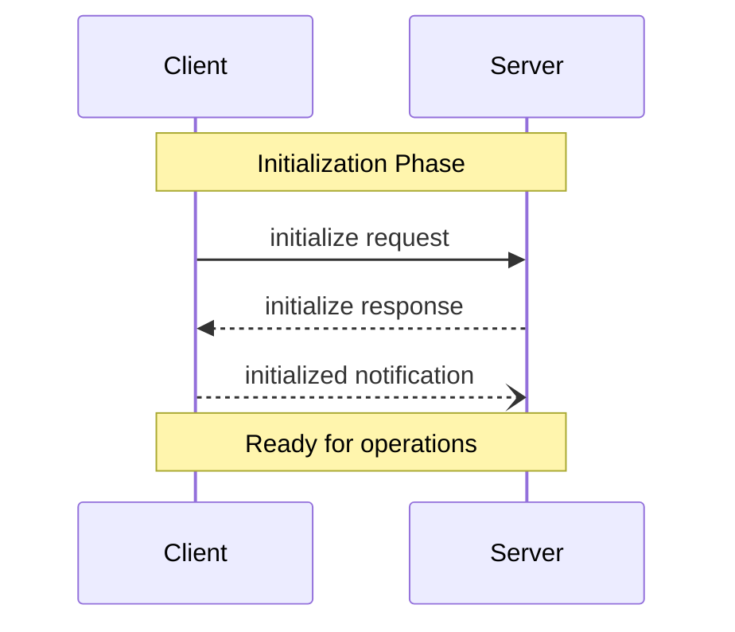

# MCP Architecture Components

**Source**: https://modelcontextprotocol.io/docs/concepts/architecture  
**Protocol Revision**: 2024-11-05

## Overview

MCP is built on a flexible, extensible architecture that enables seamless communication between LLM applications and integrations. The architecture consists of distinct layers that work together to provide secure, standardized access to external capabilities.

## Core Components

### Protocol Layer

The protocol layer handles message framing, request/response linking, and high-level communication patterns.

**Key Classes:**
- `Protocol`: Core message handling and routing
- `Client`: Client-side protocol implementation  
- `Server`: Server-side protocol implementation

**Responsibilities:**
- Message serialization/deserialization
- Request ID management and correlation
- Error propagation and handling
- Lifecycle management

### Transport Layer

The transport layer handles the actual communication between clients and servers. MCP supports multiple transport mechanisms to accommodate different deployment scenarios.

#### Stdio Transport
- **Use Case**: Local processes, same-machine communication
- **Benefits**: Simple process management, efficient for local use
- **Communication**: Standard input/output streams
- **Best For**: Development, testing, local tools

#### HTTP with SSE Transport  
- **Use Case**: Remote servers, web compatibility
- **Benefits**: HTTP compatibility, firewall-friendly
- **Communication**: Server-Sent Events for server→client, HTTP POST for client→server
- **Best For**: Remote services, web applications, cloud deployments

#### WebSocket Transport
- **Use Case**: Real-time bidirectional communication
- **Benefits**: Low latency, full duplex
- **Communication**: WebSocket protocol
- **Best For**: Interactive applications, real-time updates

**Common Foundation:**
- All transports use **JSON-RPC 2.0** to exchange messages
- Transport layer is abstracted from protocol layer
- Pluggable architecture allows custom transports

## Message Types

MCP defines three fundamental message types that form the communication foundation:

### 1. Requests
```json
{
  "jsonrpc": "2.0",
  "id": 1,
  "method": "tools/list",
  "params": {}
}
```
- **Expect a response** from the other side
- **Must include unique ID** for correlation
- **Must include method name** indicating operation
- **May include params** with operation-specific data

### 2. Results (Successful Responses)
```json
{
  "jsonrpc": "2.0",
  "id": 1,
  "result": {
    "tools": [...]
  }
}
```
- **Successful responses** to requests
- **Must include same ID** as the original request
- **Can follow any JSON structure** for result data
- **Indicates successful operation completion**

### 3. Errors (Failed Responses)
```json
{
  "jsonrpc": "2.0",
  "id": 1,
  "error": {
    "code": -32601,
    "message": "Method not found"
  }
}
```
- **Failed responses** to requests  
- **Must include error code and message** at minimum
- **Error codes must be integers**
- **Follow JSON-RPC 2.0 error format**

### 4. Notifications
```json
{
  "jsonrpc": "2.0",
  "method": "notifications/tools/list_changed"
}
```
- **One-way messages** that don't expect responses
- **Must NOT include an ID**
- **Used for**: Status updates, event notifications, state changes

## Connection Lifecycle

### 1. Initialization Phase



**Steps:**
1. **Client sends `initialize` request** with protocol version and capabilities
2. **Server responds** with its protocol version and capabilities  
3. **Client sends `initialized` notification** as acknowledgment
4. **Normal message exchange begins**

**Key Points:**
- Client SHOULD NOT send requests other than pings before server responds to initialize
- Server SHOULD NOT send requests other than pings and logging before receiving initialized notification
- Version negotiation ensures compatibility

### 2. Message Exchange Phase

After successful initialization, both parties can engage in normal protocol operations:

**Supported Patterns:**
- **Request-Response**: Either party sends requests, other responds
- **Notifications**: Either party sends one-way messages
- **Concurrent Operations**: Multiple requests can be in flight simultaneously

### 3. Termination Phase

Either party can terminate the connection through:
- **Clean shutdown**: Explicit `close()` call
- **Transport disconnection**: Network or process termination
- **Error conditions**: Protocol violations or unrecoverable errors

## Error Handling

### Standard Error Codes

MCP defines standard JSON-RPC 2.0 error codes:

| Code | Name | Description |
|------|------|-------------|
| -32700 | Parse error | Invalid JSON received |
| -32600 | Invalid Request | JSON-RPC request invalid |
| -32601 | Method not found | Method does not exist |
| -32602 | Invalid params | Invalid method parameters |
| -32603 | Internal error | Internal JSON-RPC error |
| -32000 to -32099 | Server error | Reserved for implementation-defined server errors |

**Custom Error Codes:**
- SDKs and applications can define error codes above -32000
- Should be documented and consistent within implementation

### Error Propagation

Errors are propagated through multiple mechanisms:
- **Error responses** to requests (primary mechanism)
- **Error events** on transports (connection-level issues)
- **Protocol-level error handlers** (system-level problems)

## secretGPT Integration Implications

### Hub Router Integration

```
secretGPT Hub Router
├── ComponentType.SECRET_AI     (existing)
├── ComponentType.WEB_UI        (existing)
└── ComponentType.MCP_SERVICE   (new)
    ├── MCP Client instances
    ├── Transport management
    └── Message routing
```

### Transport Selection for secretGPT

**For AttestAI Testing:**
- **WebSocket**: Real-time tool execution updates in web UI
- **HTTP+SSE**: Fallback for firewall/proxy environments

**For Production Deployment:**
- **Stdio**: Local MCP servers within TEE
- **HTTP+SSE**: Remote MCP servers with TLS

### Security Considerations

**Transport Security:**
- Use TLS for remote connections
- Validate connection origins
- Implement authentication when needed

**Message Validation:**
- Validate all incoming messages against schemas
- Check message size limits
- Verify JSON-RPC format compliance

**Resource Protection:**
- Implement access controls for MCP operations
- Validate resource paths and parameters
- Monitor resource usage and rate limits

## Best Practices for secretGPT

### Implementation Patterns

1. **Follow Hub Architecture**: MCP service integrates like Secret AI service
2. **Maintain Security**: All MCP operations included in TEE attestation
3. **User Control**: Explicit approval required for all tool operations
4. **Error Handling**: Graceful degradation when MCP servers unavailable

### Performance Considerations

1. **Connection Pooling**: Reuse connections to MCP servers
2. **Request Batching**: Group related operations when possible
3. **Timeout Management**: Implement appropriate timeouts for all operations
4. **Resource Cleanup**: Properly close connections and clean up resources

### Monitoring and Debugging

1. **Logging**: Track all MCP protocol events
2. **Metrics**: Monitor connection health and performance
3. **Diagnostics**: Implement health checks for MCP servers
4. **Testing**: Comprehensive testing across different transports

---

**Next Steps:**
- Review **[Connection Lifecycle](./mcp-lifecycle-management.md)** for detailed initialization flows
- Study **[Transport Selection](../transport/mcp-transport-selection.md)** for choosing appropriate communication methods
- Understand **[Security Model](../security/mcp-security-model.md)** for TEE integration considerations
