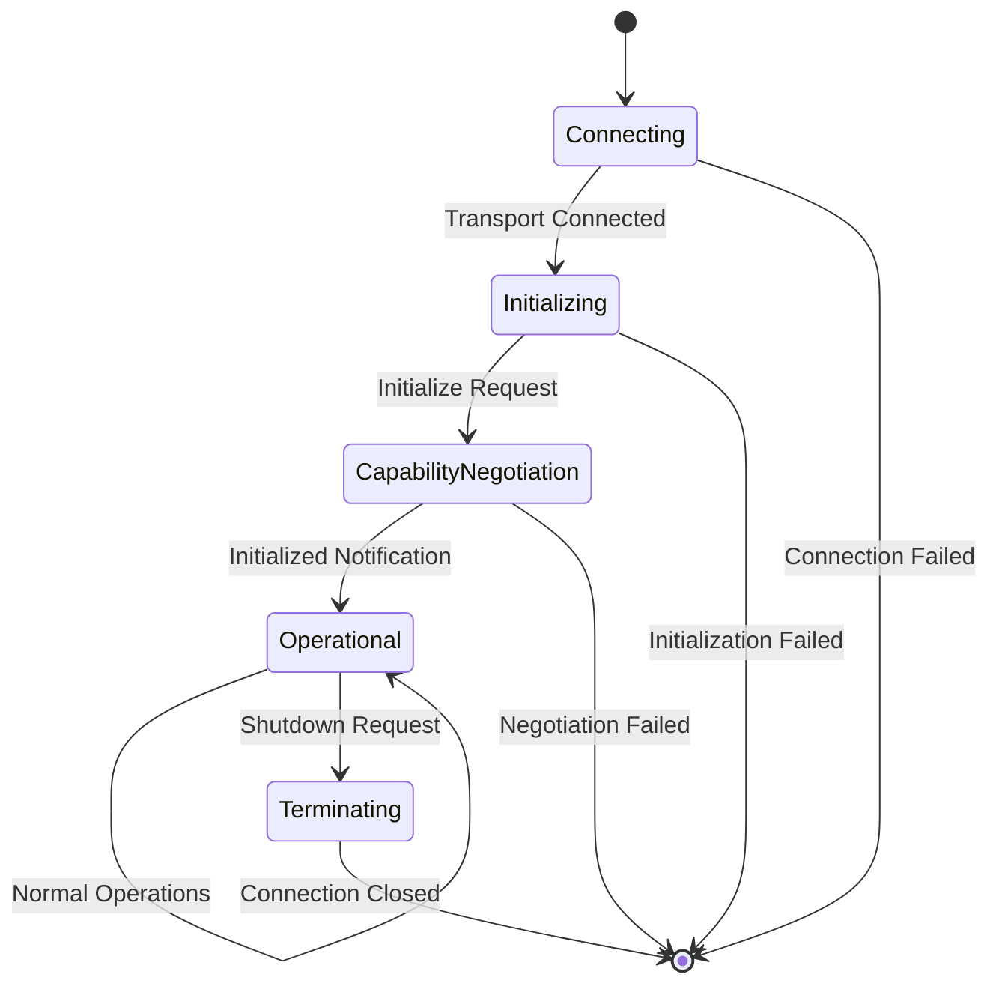

# MCP Connection Lifecycle Management

**Source**: https://spec.modelcontextprotocol.io/specification/basic/lifecycle/  
**Protocol Revision**: 2024-11-05

## Overview

The Model Context Protocol defines a rigorous lifecycle for client-server connections that ensures proper capability negotiation and state management. Understanding this lifecycle is crucial for implementing robust MCP integration in secretGPT.

## Lifecycle Phases



### Phase 1: Initialization

The initialization phase **MUST** be the first interaction between client and server.

#### 1.1 Initialize Request

**Client sends `initialize` request:**
```json
{
  "jsonrpc": "2.0",
  "id": 1,
  "method": "initialize",
  "params": {
    "protocolVersion": "2024-11-05",
    "capabilities": {
      "roots": {
        "listChanged": true
      },
      "sampling": {}
    },
    "clientInfo": {
      "name": "secretGPT",
      "version": "1.0.0"
    }
  }
}
```

**Required Parameters:**
- `protocolVersion`: Protocol version the client supports (SHOULD be latest)
- `capabilities`: Client capabilities and feature support
- `clientInfo`: Information about the client application

#### 1.2 Initialize Response

**Server responds with capabilities:**
```json
{
  "jsonrpc": "2.0", 
  "id": 1,
  "result": {
    "protocolVersion": "2024-11-05",
    "capabilities": {
      "logging": {},
      "prompts": {
        "listChanged": true
      },
      "resources": {
        "subscribe": true,
        "listChanged": true  
      },
      "tools": {
        "listChanged": true
      }
    },
    "serverInfo": {
      "name": "ExampleServer",
      "version": "1.0.0"
    }
  }
}
```

**Response Contents:**
- `protocolVersion`: Same version if supported, or highest supported version
- `capabilities`: Server capabilities and available features
- `serverInfo`: Information about the server implementation

#### 1.3 Initialized Notification

**Client confirms readiness:**
```json
{
  "jsonrpc": "2.0",
  "method": "notifications/initialized"
}
```

**Critical Points:**
- Client MUST send this notification after successful initialize response
- Server MUST wait for this before processing normal requests
- Signals that client is ready for normal operations

### Phase 2: Operation

After successful initialization, normal protocol communication begins.

#### Capability-Based Operations

Based on negotiated capabilities, the following operations become available:

**Tools (if server supports):**
```json
// Discover tools
{"method": "tools/list"}

// Execute tool
{"method": "tools/call", "params": {"name": "search", "arguments": {...}}}
```

**Resources (if server supports):**
```json
// List resources  
{"method": "resources/list"}

// Read resource
{"method": "resources/read", "params": {"uri": "file:///path/to/file"}}
```

**Prompts (if server supports):**
```json
// List prompts
{"method": "prompts/list"}

// Get prompt
{"method": "prompts/get", "params": {"name": "analyze-code"}}
```

#### Concurrent Operations

- Multiple requests can be in flight simultaneously
- Each request MUST have unique ID for correlation
- Responses can arrive in any order
- Notifications can be sent at any time

### Phase 3: Shutdown

Either party can initiate connection termination:

#### Clean Shutdown
- Explicit close() call on transport
- Allows for graceful resource cleanup
- Pending requests should be completed or cancelled

#### Abrupt Termination  
- Transport disconnection (network failure, process termination)
- Protocol violations or unrecoverable errors
- Immediate resource cleanup required

## Protocol Version Negotiation

### Version Compatibility Rules

1. **Client Request**: Client MUST send protocol version it supports
2. **Server Response**: 
   - If server supports requested version → respond with same version
   - If server doesn't support → respond with highest version it supports
3. **Compatibility Check**: Client decides if server version is acceptable
4. **Fallback**: Client can close connection if versions incompatible

### Version Strategy for secretGPT

```python
# Recommended version handling
SUPPORTED_VERSIONS = ["2024-11-05", "2024-06-18"]  # Latest first

def negotiate_version(requested_version: str) -> str:
    if requested_version in SUPPORTED_VERSIONS:
        return requested_version
    
    # Find highest compatible version
    for version in SUPPORTED_VERSIONS:
        if is_compatible(requested_version, version):
            return version
    
    # No compatible version found
    raise ProtocolVersionError(f"Unsupported version: {requested_version}")
```

## Capability Negotiation

### Client Capabilities

**secretGPT should declare:**
```json
{
  "capabilities": {
    "roots": {
      "listChanged": true  // Support for root change notifications
    },
    "sampling": {}  // Request LLM completions from server
  }
}
```

### Server Capabilities

**Common server capabilities:**
```json
{
  "capabilities": {
    "tools": {
      "listChanged": true  // Server can notify of tool changes
    },
    "resources": {
      "subscribe": true,    // Support resource subscriptions
      "listChanged": true   // Notify of resource list changes
    },
    "prompts": {
      "listChanged": true   // Notify of prompt changes
    },
    "logging": {}           // Server can send logs to client
  }
}
```

## Error Handling During Lifecycle

### Initialization Errors

**Invalid Protocol Version:**
```json
{
  "jsonrpc": "2.0",
  "id": 1, 
  "error": {
    "code": -32602,
    "message": "Unsupported protocol version",
    "data": {
      "requestedVersion": "2024-11-05",
      "supportedVersions": ["2024-06-18"]
    }
  }
}
```

**Missing Required Capabilities:**
```json
{
  "jsonrpc": "2.0",
  "id": 1,
  "error": {
    "code": -32600,
    "message": "Required capabilities not supported",
    "data": {
      "required": ["tools"],
      "available": ["resources", "prompts"]
    }
  }
}
```

### Operational Errors

**Method Not Found:**
```json
{
  "error": {
    "code": -32601,
    "message": "Method not found: unknown/method"
  }
}
```

**Invalid Parameters:**
```json
{
  "error": {
    "code": -32602, 
    "message": "Invalid params",
    "data": {
      "expected": "object",
      "received": "string"
    }
  }
}
```

## Implementation Guidelines for secretGPT

### Hub Router Integration

```python
class MCPService:
    def __init__(self):
        self.connections = {}  # server_id -> connection
        self.capabilities = {}  # server_id -> capabilities
    
    async def connect_to_server(self, server_config):
        # 1. Establish transport connection
        transport = await create_transport(server_config)
        
        # 2. Send initialize request
        init_response = await self.send_initialize(transport)
        
        # 3. Store capabilities  
        self.capabilities[server_config.id] = init_response.capabilities
        
        # 4. Send initialized notification
        await self.send_initialized(transport)
        
        # 5. Register connection
        self.connections[server_config.id] = transport
```

### Capability Validation

```python
def validate_server_capabilities(capabilities, required_features):
    """Validate that server supports required features for secretGPT"""
    
    # Check for essential capabilities
    if required_features.get("tools") and "tools" not in capabilities:
        raise CapabilityError("Server must support tools")
    
    if required_features.get("resources") and "resources" not in capabilities:
        raise CapabilityError("Server must support resources")
    
    return True
```

### Connection Health Monitoring

```python
async def monitor_connection_health(self):
    """Monitor MCP connection health and reconnect if needed"""
    for server_id, connection in self.connections.items():
        try:
            # Send ping to test connection
            await connection.ping()
        except ConnectionError:
            # Attempt reconnection
            await self.reconnect_server(server_id)
```

## Best Practices

### Initialization
1. **Always validate protocol version** before proceeding
2. **Check required capabilities** are supported
3. **Store server capabilities** for runtime feature detection
4. **Implement connection timeout** for initialization phase

### Operation
1. **Track request IDs** to correlate responses
2. **Implement request timeouts** for all operations
3. **Handle concurrent requests** properly
4. **Monitor connection health** continuously

### Shutdown
1. **Complete pending requests** when possible
2. **Clean up resources** properly
3. **Log shutdown reason** for debugging
4. **Implement reconnection logic** for temporary failures

---

**Next Steps:**
- Review **[Transport Selection](../transport/mcp-transport-selection.md)** for choosing appropriate communication methods
- Study **[Security Model](../security/mcp-security-model.md)** for secure initialization patterns
- Explore **[Hub Integration](../integration/mcp-hub-router-integration.md)** for secretGPT-specific implementation
