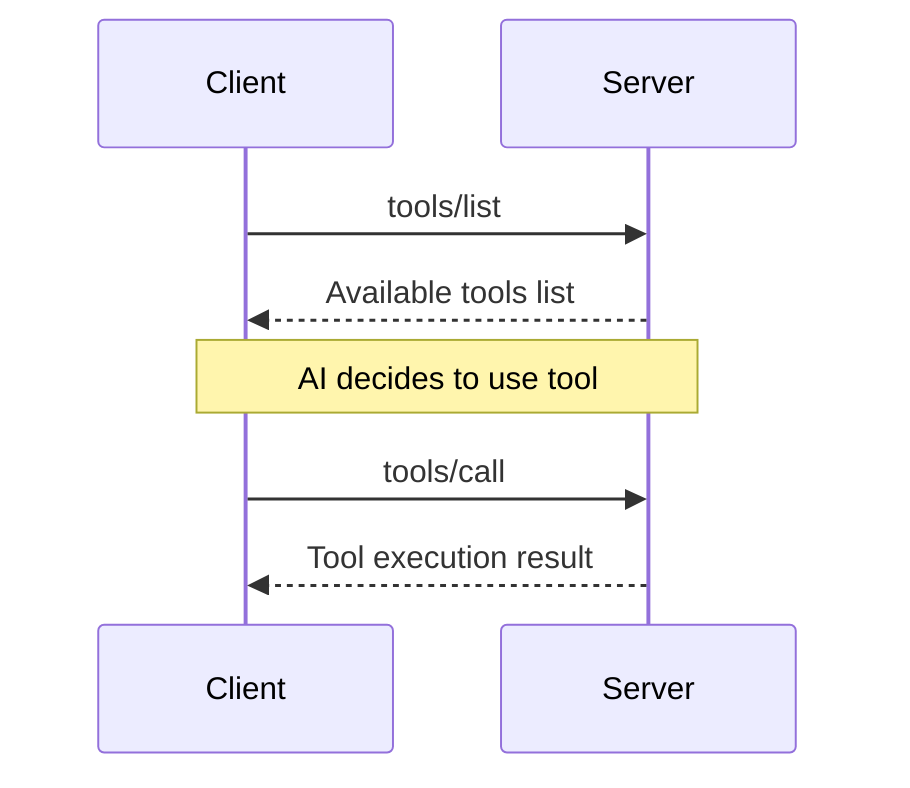

# MCP Tools Concept

**Source**: https://modelcontextprotocol.io/docs/concepts/tools  
**Protocol Revision**: 2024-11-05

## Overview

Tools are a powerful primitive in the Model Context Protocol (MCP) that enable servers to expose executable functionality to clients. Through tools, LLMs can interact with external systems, perform computations, and take actions in the real world.

**Key Principle**: Tools are designed to be **model-controlled**, meaning tools are exposed from servers to clients with the intention of the AI model being able to automatically invoke them (with a human in the loop to grant approval).

## Core Tool Concepts

### Tool Control Model
- **Model-Controlled**: AI can automatically decide to use tools
- **Human-in-the-Loop**: User approval required for tool execution
- **Atomic Operations**: Each tool performs a focused, specific task
- **Stateless**: Tools don't maintain state between invocations

### Tool vs. Resources
| Aspect | Tools | Resources |
|--------|-------|-----------|
| **Control** | Model-controlled | Application-controlled |
| **Purpose** | Perform actions | Provide data/context |
| **State** | Can modify state | Read-only access |
| **Usage** | AI decides when to use | User/app decides when to use |

## Tool Definition Structure

Each tool is defined with the following structure:

```json
{
  "name": "string",              // Unique identifier for the tool
  "description": "string",       // Human-readable description  
  "inputSchema": {              // JSON Schema for parameters
    "type": "object",
    "properties": {
      "param1": {
        "type": "string",
        "description": "Parameter description"
      }
    },
    "required": ["param1"]
  }
}
```

### Required Fields
- **`name`**: Unique identifier within the server scope
- **`inputSchema`**: JSON Schema defining parameter structure

### Optional Fields  
- **`description`**: Helps AI understand tool purpose and usage
- **`examples`**: Usage examples for better AI understanding

## Tool Discovery and Execution

### Discovery Flow


### 1. Tool Discovery

**Request:**
```json
{
  "jsonrpc": "2.0",
  "id": 1, 
  "method": "tools/list"
}
```

**Response:**
```json
{
  "jsonrpc": "2.0",
  "id": 1,
  "result": {
    "tools": [
      {
        "name": "search_files",
        "description": "Search for files in a directory",
        "inputSchema": {
          "type": "object",
          "properties": {
            "path": {
              "type": "string",
              "description": "Directory path to search"
            },
            "pattern": {
              "type": "string", 
              "description": "Search pattern (glob)"
            }
          },
          "required": ["path"]
        }
      }
    ]
  }
}
```

### 2. Tool Execution

**Request:**
```json
{
  "jsonrpc": "2.0",
  "id": 2,
  "method": "tools/call",
  "params": {
    "name": "search_files",
    "arguments": {
      "path": "/home/user/documents",
      "pattern": "*.pdf"
    }
  }
}
```

**Response:**
```json
{
  "jsonrpc": "2.0",
  "id": 2,
  "result": {
    "content": [
      {
        "type": "text",
        "text": "Found 3 PDF files:\n- report.pdf\n- manual.pdf\n- invoice.pdf"
      }
    ],
    "isError": false
  }
}
```

## Tool Categories for secretGPT

### System Operations
Tools that interact with the local system within TEE:

```json
{
  "name": "read_file",
  "description": "Read contents of a file within TEE boundaries",
  "inputSchema": {
    "type": "object",
    "properties": {
      "filepath": {
        "type": "string",
        "description": "Path to file within allowed directories"
      }
    },
    "required": ["filepath"]
  }
}
```

### Secret Network Integration  
Tools that interact with Secret Network blockchain:

```json
{
  "name": "query_secret_balance",
  "description": "Query SCRT balance for an address",
  "inputSchema": {
    "type": "object", 
    "properties": {
      "address": {
        "type": "string",
        "description": "Secret Network address (secret1...)"
      }
    },
    "required": ["address"]
  }
}
```

### API Integrations
Tools that wrap external APIs:

```json
{
  "name": "weather_lookup",
  "description": "Get current weather for a location",
  "inputSchema": {
    "type": "object",
    "properties": {
      "location": {
        "type": "string",
        "description": "City name or coordinates"
      }
    },
    "required": ["location"]
  }
}
```

### Data Processing
Tools that transform or analyze data:

```json
{
  "name": "analyze_json",
  "description": "Analyze and summarize JSON data structure",
  "inputSchema": {
    "type": "object",
    "properties": {
      "json_data": {
        "type": "string",
        "description": "JSON string to analyze"
      }
    },
    "required": ["json_data"]
  }
}
```

## Tool Error Handling

### Error Response Format

Tool errors should be reported **within the result object**, not as MCP protocol-level errors:

```json
{
  "jsonrpc": "2.0",
  "id": 2,
  "result": {
    "content": [
      {
        "type": "text", 
        "text": "Error: File not found at path /invalid/path"
      }
    ],
    "isError": true
  }
}
```

### Why Result-Level Errors?
- **LLM Visibility**: AI can see and potentially handle the error
- **Recovery Options**: AI can try alternative approaches
- **User Interaction**: AI can ask user for clarification or correction
- **Protocol Separation**: Distinguishes tool errors from communication errors

### Error Categories

**User Input Errors:**
```json
{
  "content": [
    {
      "type": "text",
      "text": "Invalid file path. Please provide a path within allowed directories."
    }
  ],
  "isError": true
}
```

**System Errors:**
```json
{
  "content": [
    {
      "type": "text", 
      "text": "Network timeout while connecting to external service. Please try again."
    }
  ],
  "isError": true
}
```

**Permission Errors:**
```json
{
  "content": [
    {
      "type": "text",
      "text": "Access denied. This operation requires additional permissions."
    }
  ],
  "isError": true
}
```

## Tool Annotations

Tool annotations provide additional metadata about tool behavior for better UX:

```json
{
  "name": "delete_file",
  "description": "Delete a file from the filesystem",
  "inputSchema": {...},
  "annotations": {
    "title": "File Deletion Tool",
    "readOnlyHint": false,
    "destructiveHint": true,
    "idempotentHint": false,
    "openWorldHint": false
  }
}
```

### Annotation Types

| Annotation | Type | Default | Description |
|------------|------|---------|-------------|
| `title` | string | - | Human-readable title for UI display |
| `readOnlyHint` | boolean | false | Tool doesn't modify environment |
| `destructiveHint` | boolean | true | Tool may perform destructive updates |
| `idempotentHint` | boolean | false | Repeated calls have no additional effect |
| `openWorldHint` | boolean | true | Tool interacts with external entities |

### secretGPT Annotation Usage

**Safe Read-Only Tool:**
```json
{
  "annotations": {
    "title": "Secret Network Balance Query",
    "readOnlyHint": true,
    "destructiveHint": false, 
    "openWorldHint": true
  }
}
```

**Destructive System Tool:**
```json
{
  "annotations": {
    "title": "File System Write",
    "readOnlyHint": false,
    "destructiveHint": true,
    "idempotentHint": false,
    "openWorldHint": false
  }
}
```

## Tool Name Conflicts

When multiple MCP servers expose tools with the same name, secretGPT should disambiguate:

### Disambiguation Strategies

**1. Server Name Prefix:**
```
filesystem___read_file
secretnetwork___read_file  
```

**2. URI-Based Prefix:**
```
local.secretgpt.com:read_file
remote.example.com:read_file
```

**3. Random Prefix:**
```
abc123___read_file
xyz789___read_file
```

## Best Practices for secretGPT

### Tool Design
1. **Clear Names**: Use descriptive, unambiguous tool names
2. **Detailed Descriptions**: Help AI understand purpose and usage
3. **Schema Validation**: Comprehensive JSON Schema for all parameters
4. **Examples**: Include usage examples in descriptions
5. **Atomic Operations**: Keep tools focused on single tasks

### Security Considerations
1. **Input Validation**: Validate all parameters against schema
2. **Path Sanitization**: Prevent directory traversal attacks
3. **Command Injection**: Sanitize system command parameters
4. **Access Control**: Check permissions before execution
5. **Audit Logging**: Log all tool usage for security review

### Performance Optimization  
1. **Timeouts**: Implement appropriate timeouts for all operations
2. **Rate Limiting**: Prevent abuse of resource-intensive tools
3. **Caching**: Cache results when appropriate
4. **Resource Cleanup**: Properly clean up after tool execution
5. **Progress Reporting**: Use progress tokens for long operations

### TEE Integration
1. **Attestable Execution**: Include tool calls in attestation proofs
2. **Secure Storage**: Use TEE-protected storage for sensitive data
3. **Key Management**: Securely handle cryptographic keys
4. **Isolation**: Isolate tool execution within TEE boundaries

## Integration with secretGPT Hub

### Message Flow
```
AttestAI UI → Hub Router → MCP Service → Tool Execution → Result
                      ↓
               Tool result included in AI prompt → Secret AI
```

### Hub Router Changes
1. **Tool Discovery**: Aggregate tools from all connected MCP servers
2. **Tool Routing**: Route tool calls to appropriate MCP server
3. **Result Processing**: Format tool results for AI consumption
4. **Error Handling**: Handle tool failures gracefully

### Attestation Integration
1. **Tool Execution Logging**: Log all tool calls and results
2. **Proof Generation**: Include tool usage in attestation proofs
3. **Verification**: Verify tool execution integrity
4. **Audit Trail**: Maintain complete audit trail of tool usage

---

**Next Steps:**
- Review **[Tool Implementation Guide](../implementation/mcp-server-development.md)** for building custom tools
- Study **[Secret Network Tools](../secret-network/secret-network-mcp-tools.md)** for blockchain integration
- Explore **[Security Model](../security/mcp-tool-sandboxing.md)** for safe tool execution
